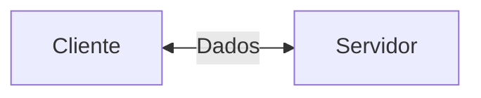
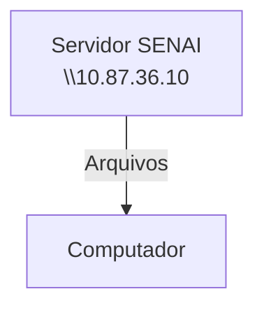
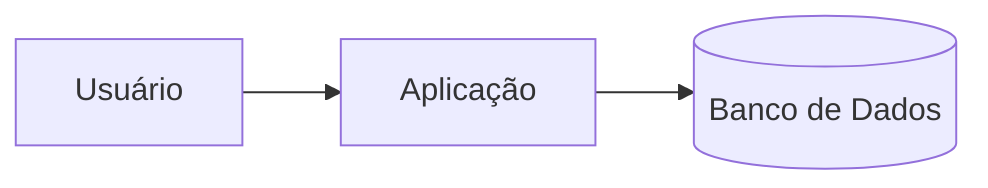
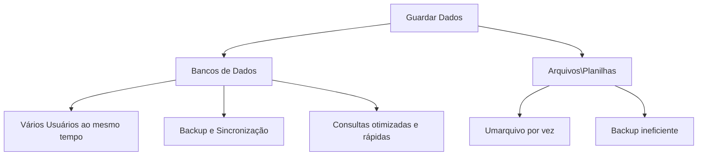

## Configurações do Servidor Educacional
Simular um ambiente real de produção.

---
**Objetivo**:
- Experiência real de mercado,
- Administração de recursos,
- Expêriencia em servidores Linux.

## Servidor de arquivos
Servidor educacional para arquivos, assim não dependendo da rede externa.


---
## Servidor de Desenvolvimento
Cada aluno recebe o seu proprio acesso, cada máquina possui um endereço de IP diferente.
>**IP:** 192.168.10.28
---
|Recurso|Configuração|
|-------|------------|
|CPU|2 cores|
|RAM|512 MB|
|DISCO| 6 BB|
|SISTEMA OPERACIONAL| Ubuntu 26.04 LTS|
|ACESSO| SSH (Secure Shell)|
---
**Dados de acesso:**
|Campo|Valor|
|-----|-----|
|IP do Container|192.168.10.28|
|Usuário|Root|
|Senha Inicial|Aluno01|
---
Comando para visualizar uso de recursos:
```bash
htop
```
Comando para trocar a senha:
```bash
passwd
```
---
## Banco de Dados
-Dados: Isolados não dizem muita coisa.
Ex: Bola, Loja, Hoje.

-Informações: Dados estruturados.
Ex: Comprei uma bola na loja hoje.

-Conhecimento: O que podemos extrair das informações.


---
Fluxo normal de bancosde dados representado a seguir.

> Por qual razão, as empresas não salvam os dados dos arquivos comuns?


---

## SGBD
Sistema Gerenciador de Banco de Dados.
> POSTGRESQL: SGBD OpenSourse e muito completo.

Primeiro começamos atualizando os pacotes
```bash
sudo apt update && upgrade
```
Para intalação do Postgresql:
```bash
sudo apt install -y postgresqp
```