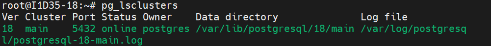
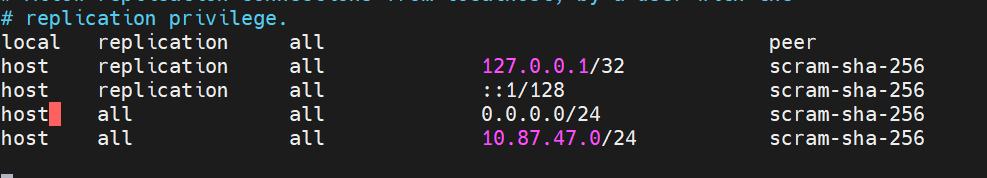

## Aula 02
Para verificar o status e demais informações do banco de dados, utilizando o comando:

```bash
pg_lsclusters
```


-------------------------
Para acesso, via root, sem senha (SOCKET LOCAL), utilizamos o comando:

```bash
sudo -u postgres psql
```
>Com esse comando, não preciso mostrar que o meu usúario é, o linux já faz a autenticação.

>`\q` retorna ao usúario anterior (/quit).

---

Para alteração de senha do usúario Postgres, utilizamos o comando:
```sql
ALTER USER postgres PASSWORD '08100';
```

Após alteração da senha, o acesso, via localhost (Socket Externo), é feito através do comando:

```bash
sudo psql -h 127.0.0.1 -U postgres
```
---

Configurações iniciais do POSTGRES:

-Para habilitar conexões externas, de outros IPs,foinecessário as seguintes etapas:

1. Navegar até a pasta do POSTGRESQL (`/etc/postgres/18/main/`).

2.  Editar o arquivo `postgresql.conf` através do comando:

```bash
sudo nano postgresql.conf
```
3. Editar a linha listen_adresses = '*'.

4. Editar o arquivo pq_hba.conf.

5. Nas últimas, linhas adicionamos as seguintes configurações: 
`host all all 0.0.0./24 scram-sha-256`
`host all all 10.87.47.0/24 scram-sha-256`


---

**Criação do primeiro Banco de Dados**


Para criar o Banco de Dados, utilizamos o comando:
```sql
CREAT DATABASE ciades:
```
Para verificar os bancos de dados existentes:
```sql 
\l
```