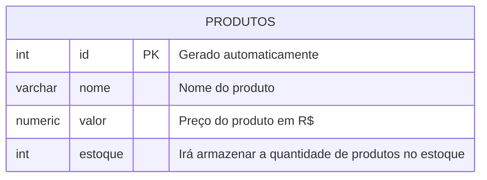
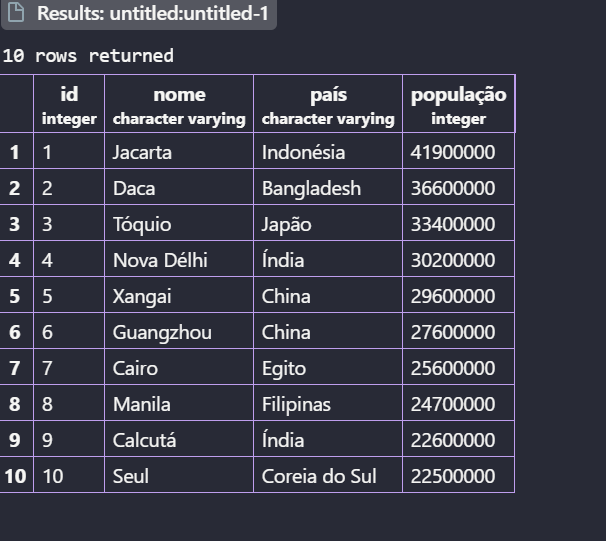

##  Aula 03
Para apagar um banco dedados, utilizamos o comando:

```sql
DROP DATABASE cidades;
```
>Não esquecer o ;

---

**Modelagem do banco de dados**


Após modelar, iremos executar as etapas de criação e inserção de dados.

---
Pra criar a primeira tabela usamos os comandos:
```sql
CREATE TABLE produtos(
    id INT GENERATED ALWAYS AS IDENTITY PRIMARY KEY,
    nome VARCHAR(100) NOT NULL,
    valor NUMERIC(10,2) NOT NULL,
    estoque INT NOT NULL DEFAULT 0
);
```
---
Para consultar todos os elementos da tabela usamos o comando 

```sql
SELECT * FROM produtos;
```
---
Pra inserir dados na tabela usamos o comando:
```sql
INSERT INTO produtos(nome,valor,estoque)
VALUES('Caneta', '1.50','100');
```
---

>Na  atividade criamos uma tabela sobre as 10 maiores cidades do mundo
Para criar a tabela usamos:
```sql
CREATE TABLE maioresCidades(
    id INT GENERATED ALWAYS AS IDENTITY PRIMARY KEY,
    nome VARCHAR(100) NOT NULL,
    país VARCHAR(100) NOT NULL,
    população INT NOT NULL 
);
```

---
Para consultar como estava a tabela:
```sql
SELECT * FROM maioresCidades;
```

---
Por ultimo para inserir as informações na tabela:
```sql
INSERT INTO maioresCidades(nome, país, população)
VALUES
('Jacarta', 'Indonésia', 41900000),
('Daca', 'Bangladesh', 36600000),
('Tóquio', 'Japão', 33400000),
('Nova Délhi', 'Índia', 30200000),
('Xangai', 'China', 29600000),
('Guangzhou', 'China', 27600000),
('Cairo', 'Egito', 25600000),
('Manila', 'Filipinas', 24700000),
('Calcutá', 'Índia', 22600000),
('Seul', 'Coreia do Sul', 22500000);
```
Após isso foi so dar o comando novamente:
```sql
SELECT * FROM maioresCidades;
```
