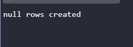
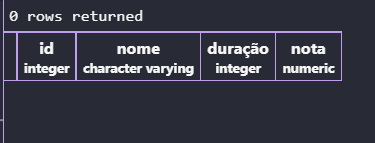
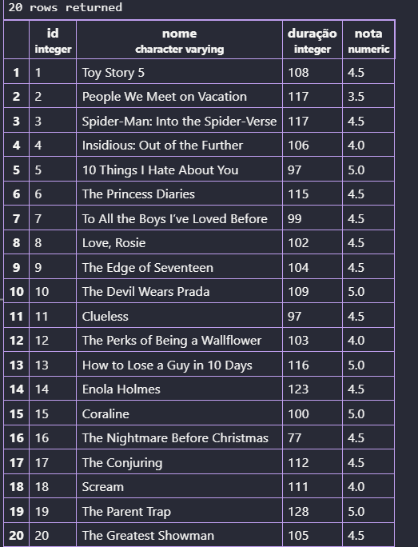
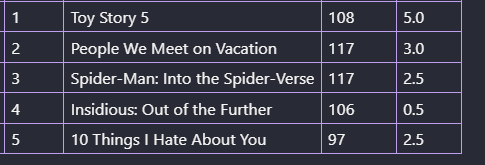
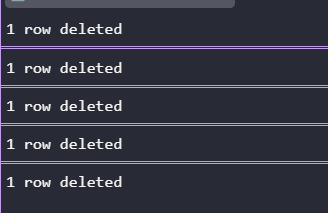
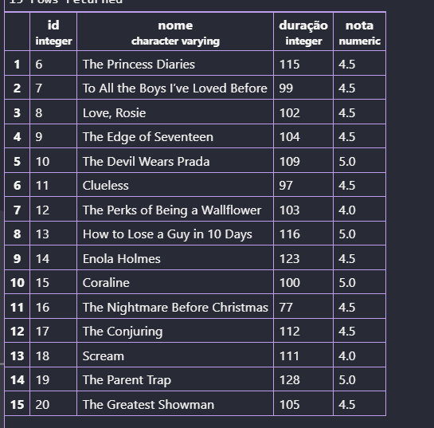

## Atividade Prática - Uptade e Delete
**Objetivo:**
- Criar um banco de dados de Streaming;
- Criar uma tabela com as colunas NOME, DURAÇÃO (MIN) e NOTA (0-5);
- Inserir 20 registros;
- Atualizar 5 dados (alterando duração ou notas);
- Apagar 5 registros.

---

Para começar a atividade foi criado uma tabela com o banco de dados de Streaming:
```sql
CREATE TABLE isaflix (
    id INT GENERATED ALWAYS AS IDENTITY PRIMARY KEY,
    Nome VARCHAR(100) NOT NULL,
    Duração INT NOT NULL,
    Nota NUMERIC(10,1) NOT NULL 
);
```


---
O comando serve para salvar e executar, é usado toda vez para atualizar a tabela com os dados novos:
```sql
SELECT * FROM isaflix
```

---
Foi colocado os dados na tabela:
```sql
INSERT INTO isaflix(nome, duração, nota)
VALUES
('Toy Story 5', 108, 4.5),
('People We Meet on Vacation',117, 3.5 ),
('Spider-Man: Into the Spider-Verse', 117, 4.5),
('Insidious: Out of the Further', 106, 4),
('10 Things I Hate About You', 97, 5),
('The Princess Diaries', 115, 4.5),
('To All the Boys I’ve Loved Before', 99, 4.5),
('Love, Rosie', 102, 4.5),
('The Edge of Seventeen', 104, 4.5),
('The Devil Wears Prada', 109, 5),
('Clueless', 97, 4.5),
('The Perks of Being a Wallflower', 103, 4),
('How to Lose a Guy in 10 Days', 116, 5),
('Enola Holmes', 123, 4.5),
('Coraline', 100, 5),
('The Nightmare Before Christmas', 77, 4.5),
('The Conjuring', 112, 4.5),
('Scream', 111, 4),
('The Parent Trap', 128, 5),
('The Greatest Showman', 105, 4.5);
```

---
Depois como parte da atividade atualizamos os dados (a nota) com o comando Update:
```sql
UPDATE isaflix --autalizar dados
SET nota = 5 WHERE id = 1;
UPDATE isaflix
SET nota = 3 WHERE id = 2;
UPDATE isaflix
SET nota = 2.5 WHERE id = 3;
UPDATE isaflix
SET nota = 0.5 WHERE id = 4;
UPDATE isaflix
SET nota = 2.5 WHERE id = 5;
```




Para finalizar foi deletado alguns filmes da tabela:
```sql
DELETE FROM isaflix WHERE id=1;
DELETE FROM isaflix WHERE id=2;
DELETE FROM isaflix WHERE id=3;
DELETE FROM isaflix WHERE id=4;
DELETE FROM isaflix WHERE id=5;
```
.

