## Atividade prática - Análise de Dados (Livraria) 📖
**Objetivo:**
- Crie um novo banco de dados para armazenar a tabela de livros
- Crie uma tabela com as colunas (id,nome,autor,preco,genero,
estoque,ano_publicacao)

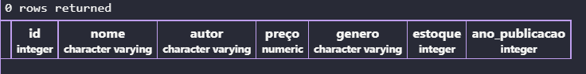
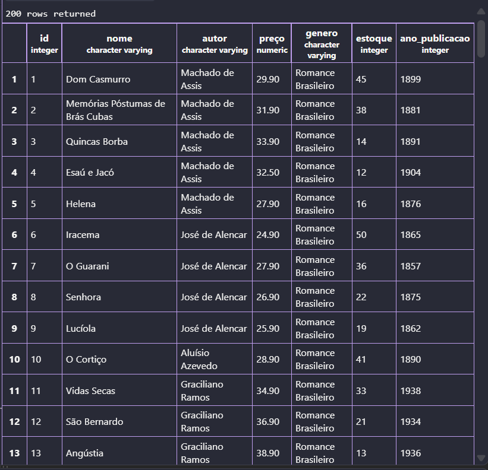

---
## Bloco 1 — Reconhecimento da base 🎯
**Objetivo:** aprender a visualizar uma base de dados.

1- É exibido apenas os 10 primeiros dados da tabela:
```sql
SELECT * FROM livros LIMIT 10;
```
 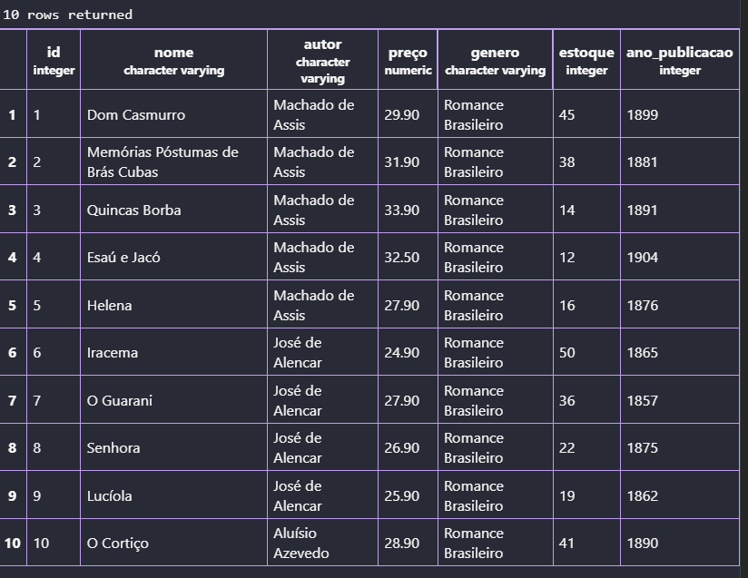

 ---
2- Como comprador só é interessante exibir as colunas nome, autor e preco de todos os livros:
```sql
SELECT nome, autor, preço FROM livros;
```
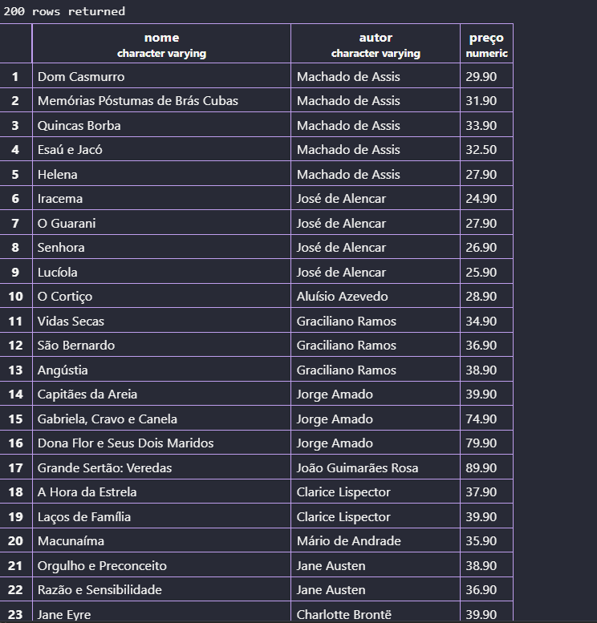

---
3- Em ordem afabetica é exibido a lista de generos distintos da livraria:
```sql
SELECT DISTINCT genero FROM livros ORDER BY genero;
```
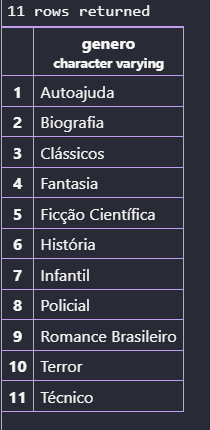

---
4- Quantos autores há:
```sql
SELECT DISTINCT autor FROM livros;
```
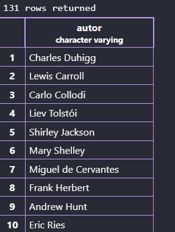

---
5- Exibe os livros mais caros em uma ordem decrescente:
```sql
SELECT nome,preço FROM livros ORDER BY preço DESC LIMIT(5);
```
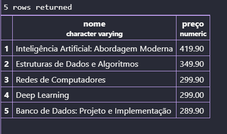

---
6- Exibe os livros com menor estoque para repor:
```sql
SELECT nome, estoque FROM livros ORDER BY estoque ASC LIMIT(5)
```
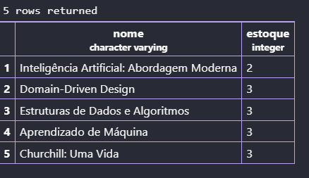

---
## Bloco 2 — Filtros numéricos 🔢
**Objetivo:** dominar os operadores de comparação e o BETWEEN.

7-Mostra o nome e estoque de todos os livros do gênero Técnico:
```sql
SELECT nome, estoque FROM livros WHERE genero = 'Técnico'
```
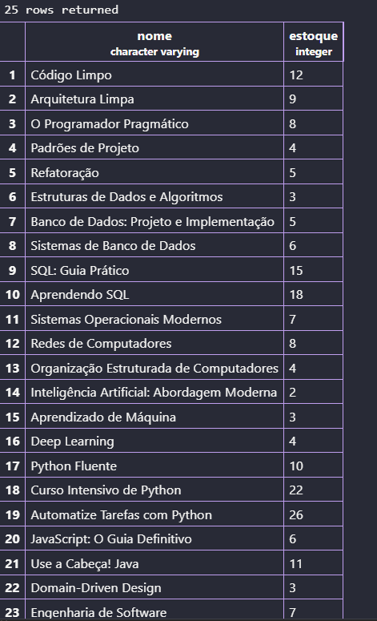

---
8- Exibe o nome e preço dos livros que custam mais de R$ 200,00:
```sql
SELECT nome,preço FROM livros WHERE preço > 200;
```
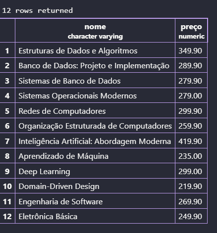

---
9- Mostra os livros que tem o preço entre 40 a 70 reais:
```sql
SELECT nome,preço FROM livros WHERE preço BETWEEN 40 AND 70;
```
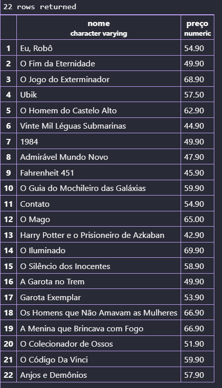

---
10- Filtra o mostra os cinco livros com menores estoque para a livraria repor:
```sql
SELECT nome,estoque FROM livros WHERE estoque <5;
```
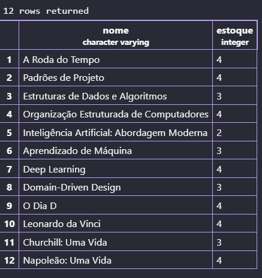

---
11-Livros publicados antes de 1900, ordenados do mais antigo para o mais recente.
```sql
SELECT nome,ano_publicacao FROM livros WHERE ano_publicacao <1900 ORDER BY ano_publicacao ASC;
```
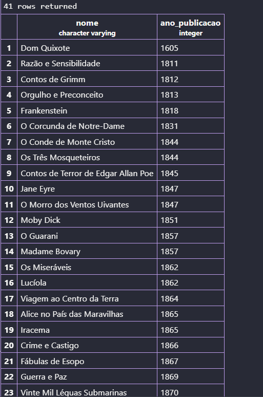

---
12- Livros publicados entre 2010 e 2020, mostrando título, ano e gênero.
```sql
SELECT nome, ano_publicacao, genero FROM livros WHERE ano_publicacao BETWEEN 2010 AND 2020 ORDER BY ano_publicacao ASC;
```
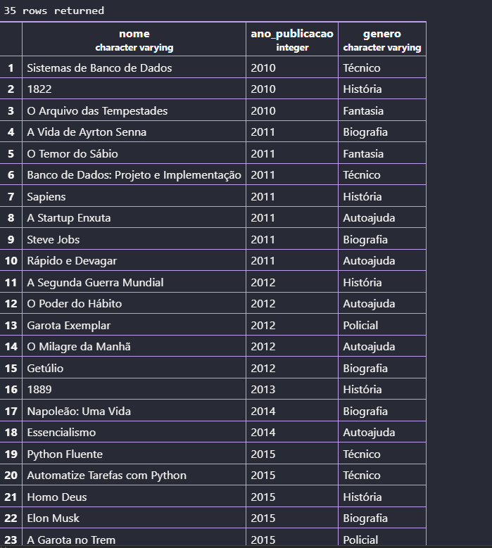